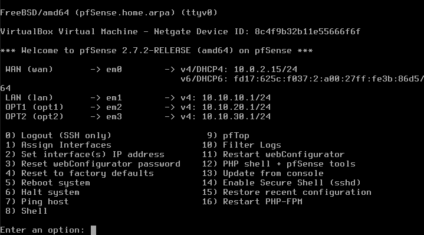
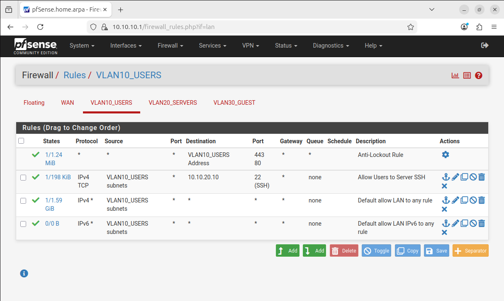
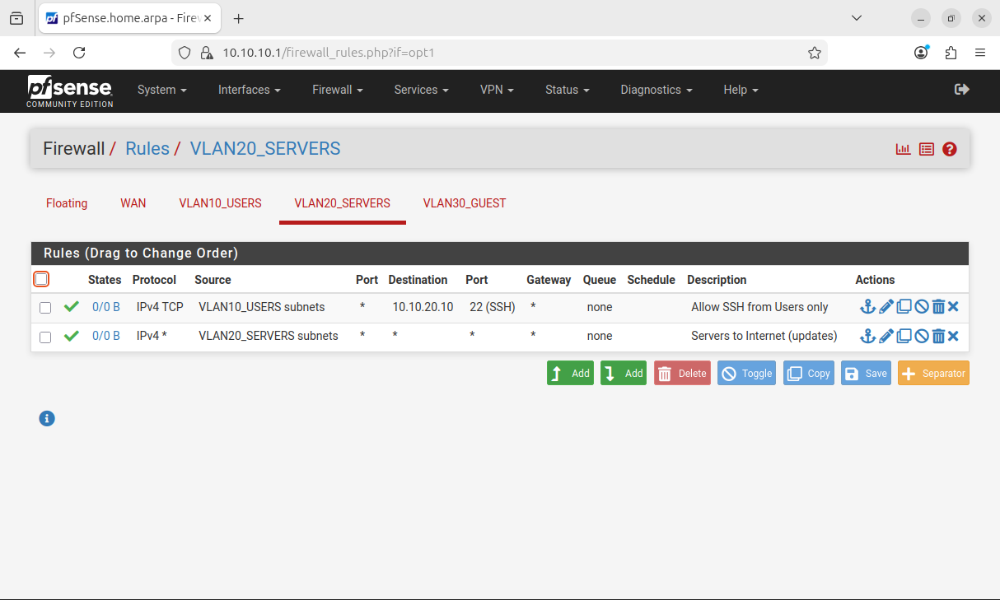
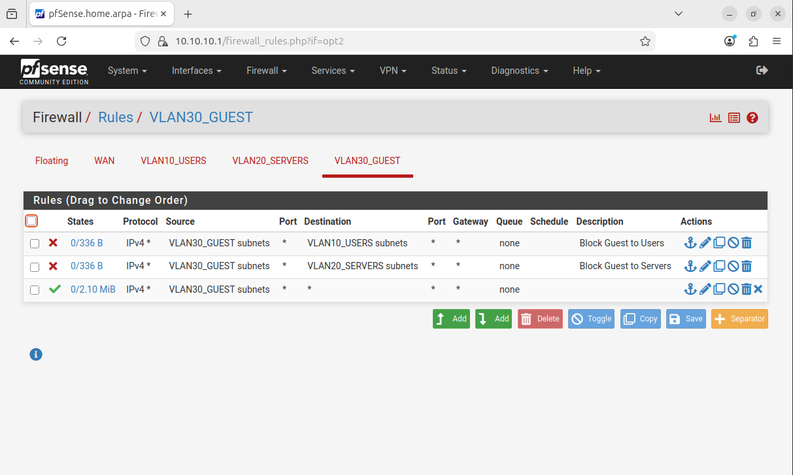
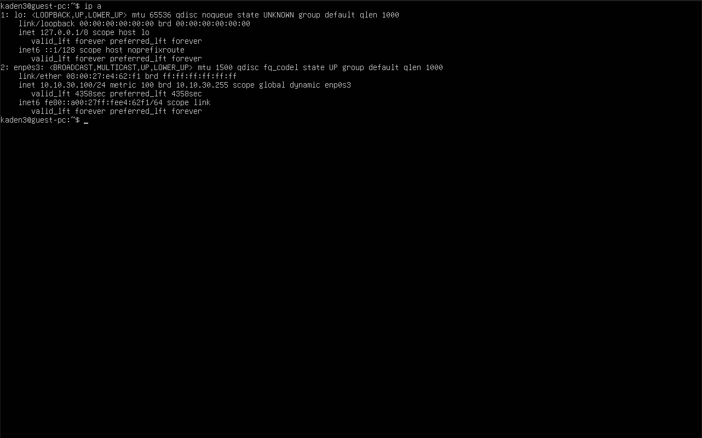
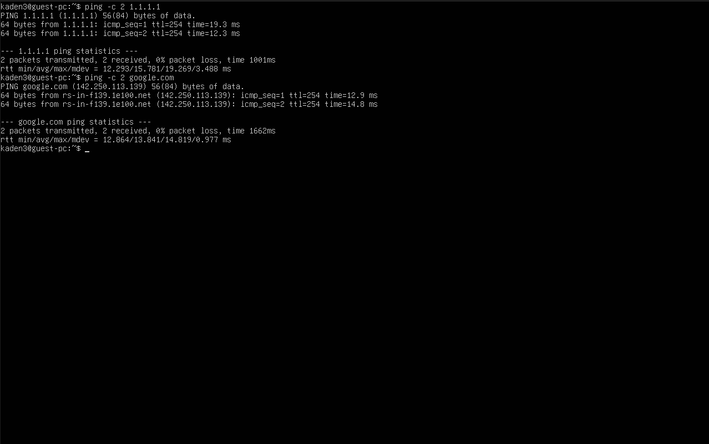
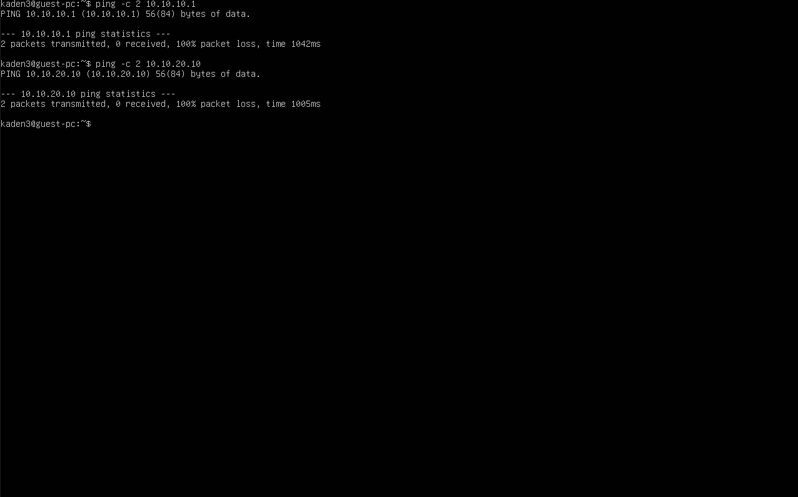
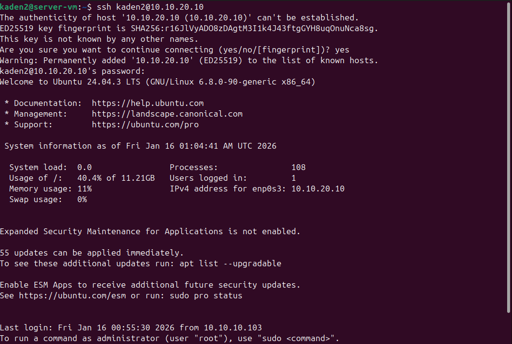

# Firewall-and-VLAN-Segmentation-lab

## Overview
Built a virtual home lab to practice real world network segmentation using pfSense as the firewall and router. The lab separates Users, Servers, and Guests into different subnets and enforces traffic rules to prevent lateral movement while still allowing required access.

## Goals
- Segment a network into three zones: Users, Servers, Guests
- Allow internet access for Users and Guests
- Block Guest access to internal networks
- Allow controlled administrative access from Users to the Server using SSH

## Lab Topology

### Networks
- VLAN10_USERS: `10.10.10.0/24`  Gateway `10.10.10.1`
- VLAN20_SERVERS: `10.10.20.0/24`  Gateway `10.10.20.1`
- VLAN30_GUEST: `10.10.30.0/24`  Gateway `10.10.30.1`

### Virtual Machines
- pfSense Firewall Router
  - WAN: VirtualBox NAT
  - LAN: VLAN10_USERS `10.10.10.1/24`
  - OPT1: VLAN20_SERVERS `10.10.20.1/24`
  - OPT2: VLAN30_GUEST `10.10.30.1/24`

- User PC (Ubuntu) on VLAN10_USERS
  - DHCP address: `10.10.10.x`

- Server VM (Ubuntu) on VLAN20_SERVERS
  - Static address: `10.10.20.10`
  - Service: OpenSSH Server (SSH)

- Guest PC (Ubuntu) on VLAN30_GUEST
  - DHCP address: `10.10.30.x`

## Key Configuration

### pfSense Interface Naming
- LAN renamed to `VLAN10_USERS`
- OPT1 renamed to `VLAN20_SERVERS`
- OPT2 renamed to `VLAN30_GUEST`

### DHCP
- VLAN10_USERS: Enabled (Users receive `10.10.10.x`)
- VLAN30_GUEST: Enabled (Guests receive `10.10.30.x`)
- VLAN20_SERVERS: Disabled (Server uses static IP `10.10.20.10`)

### Firewall Rules Summary

#### VLAN30_GUEST (Guest lockdown)
- Block Guest → VLAN10_USERS
- Block Guest → VLAN20_SERVERS
- Allow Guest → Internet (any destination)

#### VLAN10_USERS (Admin access + internet)
- Allow Users → Server SSH (TCP 22 to `10.10.20.10`)
- Allow Users → Internet (any destination)

#### VLAN20_SERVERS (Controlled exposure)
- Allow SSH from VLAN10_USERS → `10.10.20.10` (TCP 22)
- Allow Servers → Internet (updates)

## Validation Tests (Proof)

### Guest PC (expected behavior)
- Internet access works
  - `ping 1.1.1.1` succeeds
  - `ping google.com` succeeds
- Access to internal networks is blocked
  - `ping 10.10.10.1` fails
  - `ping 10.10.20.10` fails
  - `ssh kaden2@10.10.20.10` fails

### User PC (expected behavior)
- Admin path to server works
  - `ssh kaden2@10.10.20.10` succeeds

## Screenshot Documentation

### pfSense configured (WAN + VLAN10 + VLAN20 + VLAN30)

### VLAN10 Users firewall rules

### VLAN20 Servers firewall rules

### VLAN30 Guest firewall rules

### Guest got DHCP (10.10.30.x)

### Guest allowed to Internet

### Guest blocked from Users and Servers

### User can SSH into Server

## What I Learned
- VLAN style segmentation using separate routed subnets
- pfSense interface setup, DHCP per interface, and gateway routing
- Firewall rule ordering and least privilege policy design
- Validating segmentation with ping and SSH tests

